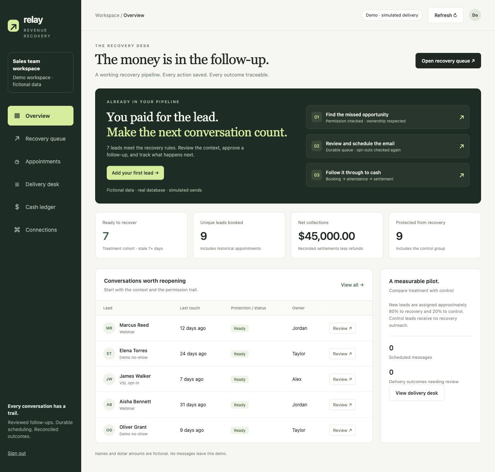

# Relay — Revenue Recovery

**A working lead-recovery app for sales teams that measure cash collected.**

Relay gives neglected leads a reviewed follow-up, tracks the next appointment, and reconciles settlements and refunds. A Flask API, persistent SQLite database, and separate delivery worker power the product. Business rules run on the server.



## Product capabilities

- **Server-side sign-in:** hashed passwords, expiring database sessions, HttpOnly cookies, CSRF protection and login attempt limits.
- **Lead management:** create/edit, search/filter, atomic CSV import, and spreadsheet-safe CSV export.
- **Reviewed recovery:** editable contextual email templates, permission evidence, ownership, human approval and scheduling.
- **Protection rules:** opt-outs, customers, active conversations, control leads, recent touches and missing permission evidence block recovery.
- **Durable delivery:** a separate worker rechecks protections and uses STARTTLS SMTP in live mode. Ambiguous delivery is never automatically retried.
- **Appointments:** booking, attendance, no-shows, cancellations, rescheduling and reviewed reminders. Changes cancel queued reminders; send-time checks verify the appointment snapshot.
- **Cash reconciliation:** integer cents, unique provider references, multiple settlements, linked refunds and enforced refund limits.
- **Pilot cohorts:** approximately 80/20 random assignment, fixed cohorts, unique booked leads, net collections and net collections per lead.
- **Audit history:** operators, timestamps, protection edits, approvals, delivery outcomes, appointments, settlements and refunds.
- **CRM contact lookup:** credential-gated Close and HighLevel import by contact ID. HighLevel includes location checks and a DND recheck before live sends. Imported contacts start without outreach permission.
- **Separate demo workspace:** fictional data and simulated delivery using the same database and scheduling rules.

## Run the demo

Requires **Python 3.12+**. Node is only needed for the optional JavaScript syntax check.

```bash
git clone https://github.com/JuniorAJ1/relay-revenue-recovery.git
cd relay-revenue-recovery
python3.12 -m venv .venv
source .venv/bin/activate
pip install -r requirements.txt
python manage.py serve
```

Open **http://127.0.0.1:8766/** and choose **Open demo workspace**. A database is seeded with 25 fictional leads and sample transactions. Changes survive refreshes and server restarts.

Demo mode is the default. It cannot import real CRM data or send messages. Its convenient demo login is available to anyone who can reach that demo instance; keep it local and keep real data in a separate live workspace.

Use **Delivery desk → Run demo worker** to process due demo jobs, or run a worker in another terminal:

```bash
source .venv/bin/activate
python manage.py worker
```

The worker polls every five seconds and processes up to 20 jobs per cycle. `python manage.py worker --once` runs one cycle.

## Two-minute walkthrough

1. Open a ready lead and inspect its context and permission evidence.
2. Generate a template, edit it, and approve a send time in your local timezone.
3. Inspect the delivery desk. Demo delivery is explicitly marked **simulated**.
4. Record a booked reply. Queued recovery emails are cancelled.
5. Approve a reminder, then reschedule. Old reminders are cancelled and replacements need review.
6. Record attendance, a settlement with a unique reference, and a partial refund.
7. Inspect the cash ledger and audit trail; refresh to confirm persistence.

## Live pilot setup

This version serves **one trusted sales workspace**. Authenticated operators share records and permissions; there is no public signup or customer isolation.

Copy `.env.example` to `.env` and set:

```dotenv
DEMO_MODE=false
DATABASE_PATH=instance/live.sqlite3
SECRET_KEY=<random secret of at least 32 characters>
COOKIE_SECURE=true
APP_BASE_URL=https://your-relay-domain.example
LIVE_SEND_ENABLED=false
```

Use a fresh database: the app refuses to mix demo and live modes. Generate a secret using `python -c "import secrets; print(secrets.token_urlsafe(48))"`. Never commit `.env` or databases.

Create operator accounts with interactive passwords:

```bash
python manage.py create-user --email you@example.com --name "Your name"
```

Run Gunicorn behind an HTTPS reverse proxy, and supervise a separate worker:

```bash
gunicorn --bind 127.0.0.1:8000 --workers 2 --timeout 60 wsgi:app
python manage.py worker
```

Configure `SMTP_HOST`, `SMTP_PORT` (default 587), `SMTP_FROM`, and SMTP credentials. Test delivery and the public unsubscribe page before enabling `LIVE_SEND_ENABLED=true`. The worker appends a signed unsubscribe link; confirmation saves the recipient's preference and cancels queued emails.

Configure `CLOSE_API_KEY` or `HIGHLEVEL_TOKEN` plus `HIGHLEVEL_LOCATION_ID` for contact lookup. HighLevel uses `Version: v3`. Credentials stay on the server and are not returned to the browser or committed.

Imported contacts require a human to review CRM history, opt-outs, owner, customer status and permission evidence. Close lookup does not continuously synchronize unsubscribes or stages. Absence of a local opt-out does not establish permission. HighLevel delivery is blocked if its DND evidence is unavailable or changed.

### Delivery states

| State | Meaning |
| --- | --- |
| Queued | Approved and waiting for its due time |
| Simulated | Demo processed; nothing sent |
| Sent | SMTP accepted the message; inbox delivery is not confirmed |
| Blocked | Disabled/unconfigured delivery, rejection or changed protections; review a new job after resolving |
| Cancelled | Lead/appointment changed or an operator cancelled |
| Unknown | Timeout/interruption may have occurred after acceptance; reconcile provider records before another send |

There is no automatic retry for unknown outcomes. Use the delivery desk’s Reconcile action after checking SMTP records; evidence is required. Confirmed acceptance preserves the send, while a confirmed failure permits a new human-reviewed job. Queued reminders are cancelled on appointment changes; an email already in progress cannot be recalled. Writes serialize during the worker's send-time check and SMTP handoff. SQLite and one worker suit a small pilot, not a large multi-tenant service.

`Dockerfile` and `compose.yaml` package separate web/worker services with a shared named database volume. Copy `.env.example` to `.env` before `docker compose up --build`. The web port binds to loopback; HTTPS and a public domain require your reverse proxy. Docker packaging was not runtime-tested in the development environment.

Back up SQLite with its backup API and verify restores. Keep session records, databases and secrets outside Git. Changing `SECRET_KEY` invalidates unsubscribe links. Password reset and operator-removal screens are not included.

## CSV import

Required: `name,email`. Optional: `source,owner,phone,context,last_touch,consent,consent_note,opted_out,customer,active,cohort`.

Use ISO timestamps with timezone, booleans `true/false` or `1/0`, and cohorts `treatment/control`. Missing consent defaults to false; missing last touch defaults to now; a missing cohort is randomly assigned. Batches support up to 1,000 rows and 2 MB. Duplicate or invalid rows roll back the entire batch.

```csv
name,email,owner,last_touch,consent,consent_note,cohort
Example Lead,lead@example.com,Alex,2026-09-01T10:00:00+00:00,false,,treatment
```

This example imports a protected contact. Verify permission in the app before outreach.

## Architecture

```text
Browser → Flask API → SQLite (sessions, leads, jobs, appointments, payments, events)
                          ↑
                   Separate worker → SMTP
                   Contact lookup → Close / HighLevel
```

| Location | Responsibility |
| --- | --- |
| relay/app.py | HTTP API, authentication, exports and unsubscribe |
| relay/service.py | Lead, appointment, scheduling and financial rules |
| relay/db.py | Schema, transactions and startup migration |
| relay/worker.py | Durable claiming, send-time checks and SMTP |
| relay/connectors.py | Read-only CRM contact adapters |
| relay/seed.py | Fictional demo data |
| static/ | Separate frontend HTML, CSS and JavaScript |
| tests/ | API, ledger, scheduling, worker and adapter tests |
| prototype/ | Original standalone concept retained for reference |

## Verification

```bash
python -m unittest discover -s tests -v
node --check static/app.js
```

The 26 automated tests cover authentication/CSRF, login limits, mode separation, protected leads, atomic import, export injection protection, persistence, concurrent claiming, unsubscribe, SMTP TLS/message construction, unknown delivery, stale reminders, duplicate transactions and refund bounds. SMTP and CRM adapters use mocks; real credentials were not available for live verification.

Browser verification covered approval, booking, reminder cancellation on reschedule, attendance, settlement, refund, and persistence after a server restart. Pinned Python dependencies were checked with `pip-audit`; no known vulnerabilities were reported at the final scan. GitHub Actions runs the suite and JavaScript syntax check.

## Current boundaries

Drafting uses **contextual templates, not an AI model**. SMS, OAuth onboarding, continuous CRM sync, automatic replies, calendar-provider sync, payment webhooks, multi-currency accounting, role-based access and multiple-workspace isolation are not implemented. Reply-based opt-outs require operator handling; the signed unsubscribe link updates the app automatically.

Transactions are **manually reconciled**; Relay neither processes payments nor independently confirms settlement. Cohort comparisons are descriptive and demo figures are fictional. Agree on selection, collection/refund windows and provider reconciliation before assessing incremental revenue.

API references: [Close authentication](https://developer.close.com/api/overview/api-key-authentication), [Close contact lookup](https://developer.close.com/api/resources/contacts/get), [HighLevel contact lookup](https://marketplace.gohighlevel.com/docs/ghl/contacts/get-contact/index.html).
